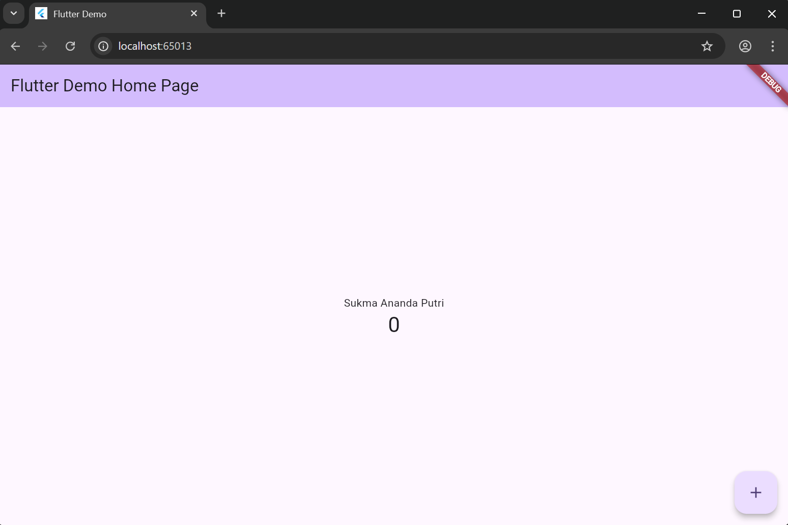
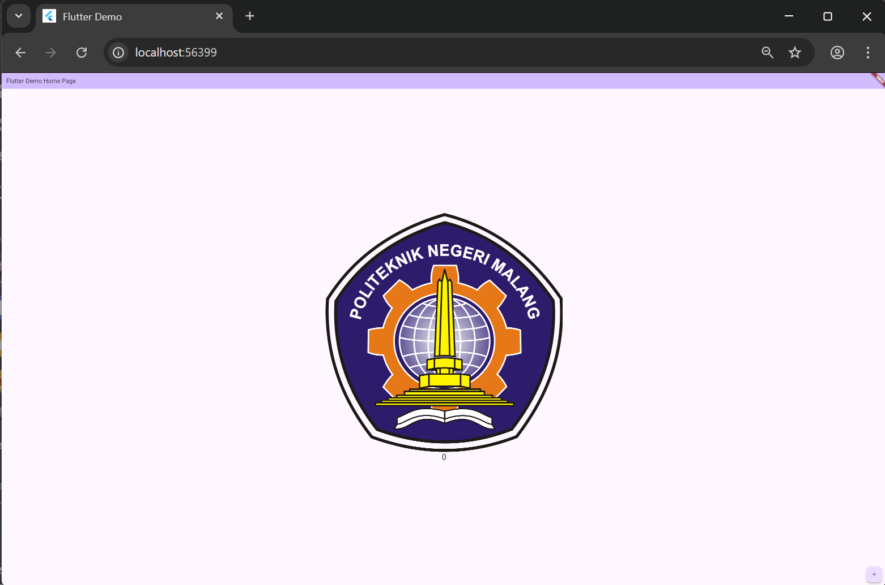
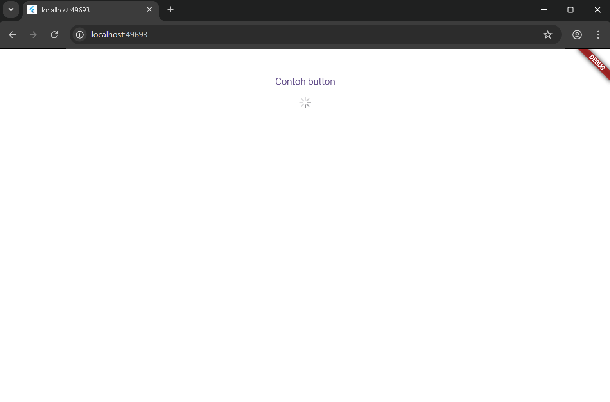
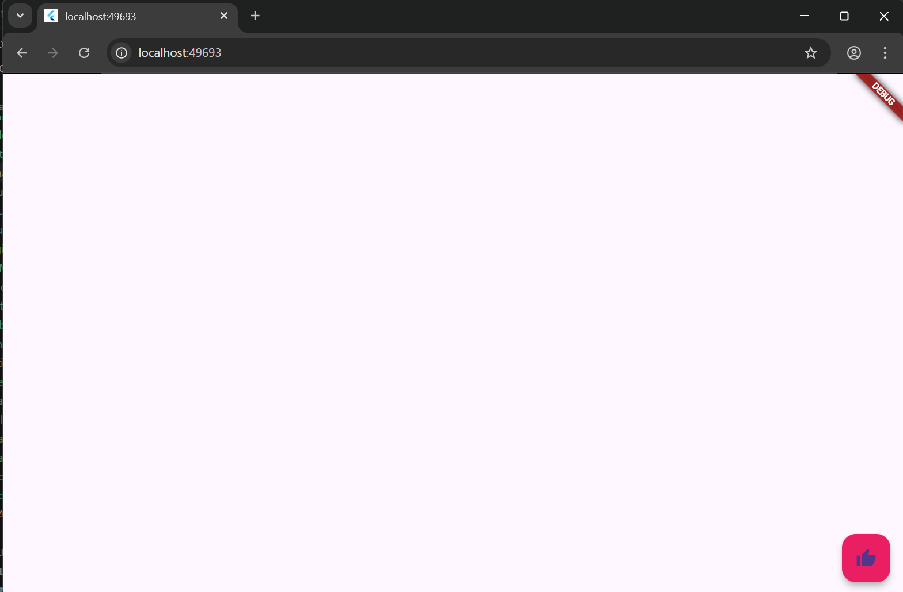
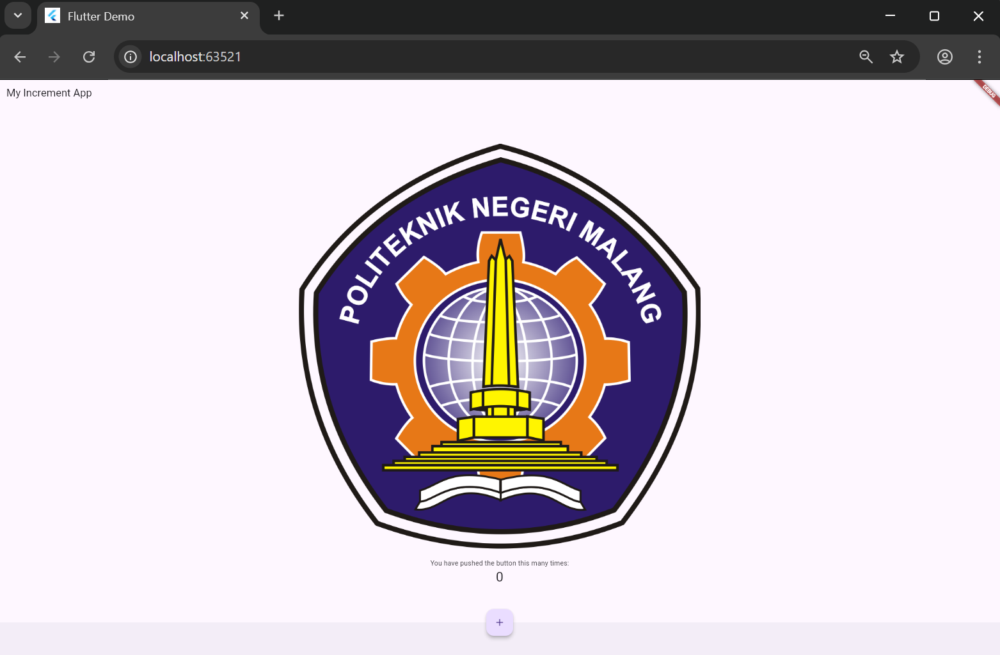
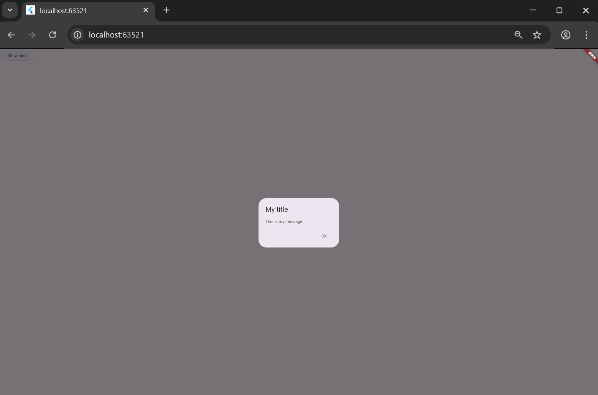
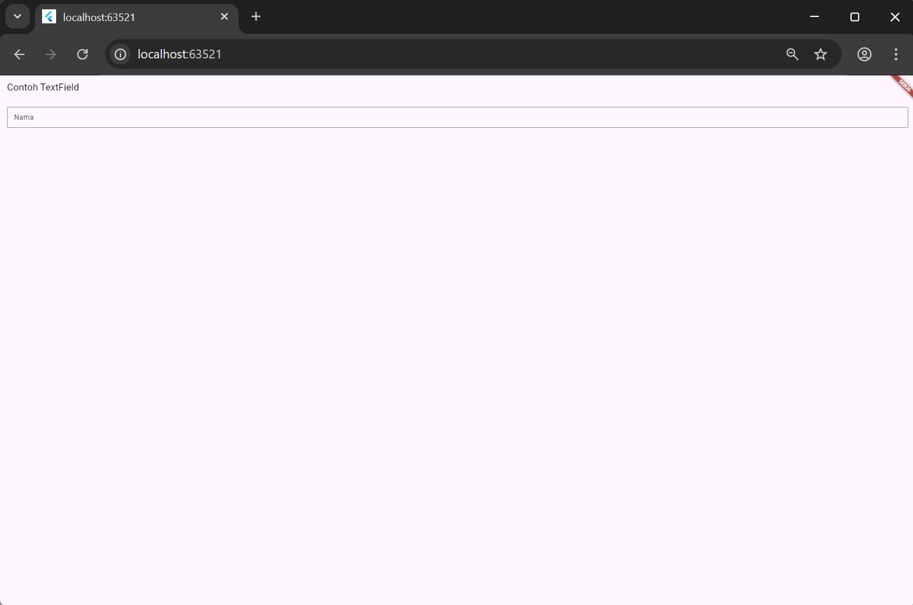
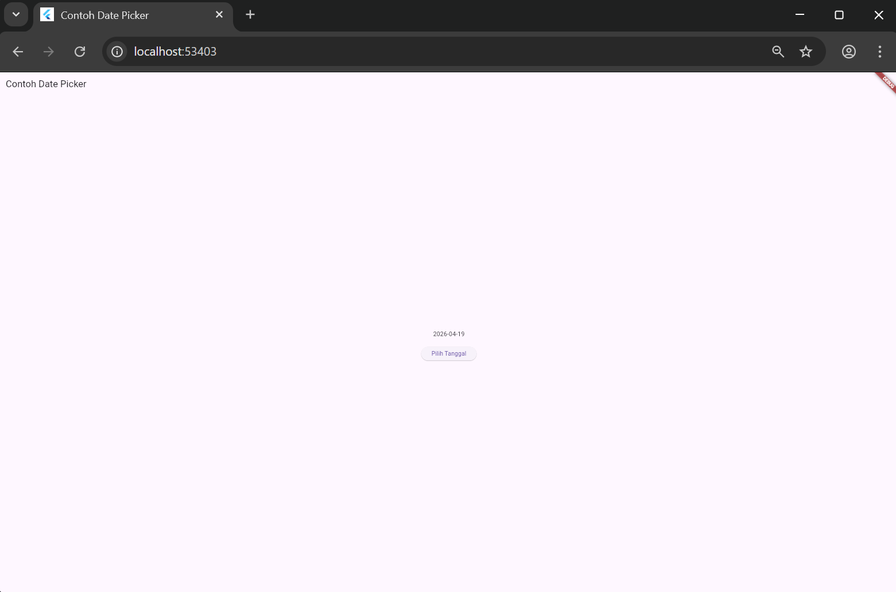
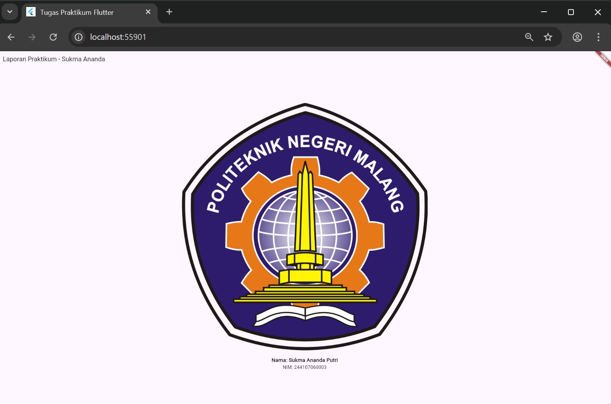

# hello_word

A new Flutter project.

Langkah 1: Cupertino Button & Loading Bar
Fungsi: Menggunakan widget dari library cupertino.dart.

Penjelasan: Langkah ini bertujuan untuk menunjukkan bahwa Flutter bisa menampilkan antarmuka (UI) khas iOS. Widget CupertinoButton memberikan efek klik ala iPhone, dan CupertinoActivityIndicator menampilkan ikon loading yang biasa kita lihat di perangkat Apple.

Langkah 2: Floating Action Button (FAB)
Fungsi: Menampilkan tombol aksi melayang.

Penjelasan: FAB adalah komponen utama Material Design. Di sini kita belajar cara membuat tombol bulat yang melayang di atas konten utama, memberikan warna (Colors.pink), dan memberikan ikon menggunakan Icon(Icons.thumb_up).

Langkah 3: Scaffold Widget
Fungsi: Mengatur struktur dasar tata letak aplikasi.

Penjelasan: Scaffold bertindak sebagai kerangka. Langkah ini mempraktikkan cara mengatur posisi FAB agar menyatu dengan bar bawah (centerDocked) dan menggunakan BottomAppBar untuk memberikan ruang di bagian bawah layar.

Langkah 4: Dialog Widget
Fungsi: Menampilkan pesan pop-up (peringatan).

Penjelasan: Menggunakan fungsi showDialog dan widget AlertDialog. Ini digunakan untuk memberikan informasi penting atau meminta konfirmasi dari pengguna sebelum melakukan aksi tertentu.

Langkah 5: Input Widget (TextField)
Fungsi: Mengambil input teks dari pengguna.

Penjelasan: Menggunakan widget TextField dengan InputDecoration. Properti OutlineInputBorder memberikan bingkai kotak agar area input terlihat jelas, dan labelText berfungsi sebagai petunjuk pengisian bagi pengguna.

Langkah 6: Date Picker
Fungsi: Memilih tanggal dari kalender sistem.

Penjelasan: Menggunakan fungsi showDatePicker. Langkah ini mengajarkan cara menangani data waktu (DateTime) dan cara memperbarui tampilan layar secara otomatis menggunakan setState setelah pengguna memilih tanggal di jendela kalender.